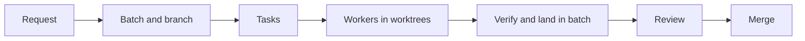

# Overseer

Overseer is a local dashboard for driving coding-agent CLIs (Claude Code, Codex CLI and OpenCode) through one orchestrator session. You describe the work in Chat; the orchestrator splits it into tasks, runs each task with a worker in its own Git worktree, and collects the passing changes on one batch branch. You inspect that batch once, then merge it into the base branch or reject it with feedback.

It exists because running several coding agents by hand means juggling checkouts, terminal sessions and half-finished results. Overseer does that coordination: it turns a request into isolated tasks, tracks the worker processes, and gathers verification results, so the human only answers questions, makes decisions and reviews the finished batch.

[Demo video](https://davidwolf.me/videos/overseer-demo.mp4) · [Case study](https://davidwolf.me/projects/overseer)

## How it works



The orchestrator is a Claude Code session that calls the daemon's MCP tools; the daemon owns worker lifecycles and stored state. Each worker gets its own worktree based on the batch branch. Verification gates each task's change, and the final review gates the batch. A repository merges locally or through a GitLab merge request.

## Highlights

**Parallel agents in isolated worktrees.** Every task is a Beads issue assigned to a worker, and each worker uses its own Git worktree, so sibling tasks progress without sharing a checkout. Dependencies decide which tasks are ready; independent tasks run concurrently up to the repository's worker limit.

**Model-reviewed changes with capped review rounds.** After verification, a critic session can review a task's change. The critic uses a different model from the worker, and the repository setting caps the number of rounds. Must-fix findings send the work back to a worker; should-fix findings are recorded for the batch review.

**Verification and evidence gates.** A configured verify command runs in the task worktree when its worker ends. Only a passing task lands in its batch; a failure or timeout reopens it with a note. An optional full-suite review command runs once against the whole batch before it is handed over, and the verify, overlap and in-review gates guard every merge. Screenshots and probe output are stored as evidence outside the repository and listed on the Evidence screen.

**Cost tracking and usage-aware account routing.** The Usage screen breaks reported and estimated cost and token use down by model, account, harness and repository over 7, 30 or 90 days, and keeps unknown amounts labeled instead of counting them as zero. Model routing resolves each task tier to a harness and model, skipping a Claude OAuth account at the usage threshold (95 percent by default) or one that recently ran out, and moving up a tier after a failed attempt.

**Lessons fed back into the prompts.** The daemon records what needed a human during a batch: rejections, reopens, re-dispatches and corrections in Chat. After the batch ends, the orchestrator reads that retrospective, and when it reveals a rule the prompts should carry, it opens a batch that adds a dated entry to `docs/lessons.md` and makes the matching prompt edit. That batch is reviewed like any other, so no prompt change is applied without approval.

**The live pixel-art Office.** The Office screen draws every running session (orchestrator, worker or critic) as a pixel-art character on an isometric floor plan, rendered with PixiJS. Characters walk in, work, verify, review, stall or leave as their session changes state, fed by the daemon's WebSocket. Clicking a worker opens its task; clicking the orchestrator opens Chat.

## Screens

Besides the Office, the web app has a **Board** (live batches and their tasks in Ready, Blocked, Running, Verifying, Review and Done columns), **Chat** with the orchestrator, **Review** (a batch's summary and combined diff with merge, reject and abandon), **Usage**, **Evidence** and **Setup** (prerequisites, daemon restart, accounts, notifications, model routing and repository settings).

## Tech stack

- **Daemon:** Node.js 22.13 or later with Fastify, serving REST and a WebSocket under `/api` and an MCP server under `/mcp`. State lives in `node:sqlite`, with no native build step. The daemon also holds the Beads bridge, Git worktree and merge operations, the session manager, the lifecycle state machine and the harness adapters.
- **Web:** React served through Vite, talking only to `/api`; the Office is drawn with PixiJS using PixelLab art.
- **Shared:** a package of API types used by both sides, in a pnpm monorepo.
- **Agents and tools:** Claude Code for the orchestrator; Claude Code, Codex CLI or OpenCode for workers; the Beads CLI `bd` for tasks; `glab` for repositories that merge through GitLab.

## Quick start

```powershell
corepack enable
pnpm install
pnpm dev
```

Open http://localhost:5173. The daemon listens on port 4400 and the web UI proxies its `/api` requests. If no repository is registered, the dashboard opens Setup, which checks the prerequisites and shows install guidance for anything missing.

## Documentation

- [Getting started](docs/guide/getting-started.md): prerequisites, install and first use
- [Batch flow and failure handling](docs/guide/batch-flow.md): retries, review rounds, retrospectives and merges
- [Screens](docs/guide/screens.md): Office, Board, Chat, Review, Usage, Evidence and Setup
- [Setup and configuration](docs/guide/configuration.md): accounts, models, tiers and environment variables
- [REST API](docs/guide/api.md): endpoints and the event socket
- [Layout and development](docs/guide/development.md): packages, commands and tests
- [Known limits and status](docs/guide/limits.md): harness status and open gaps

## License

[MIT](LICENSE). Parts of the Office code are ported from Claude-Office under its own MIT license; see [packages/web/src/office/LICENSE.txt](packages/web/src/office/LICENSE.txt).

Built by David Wolf
